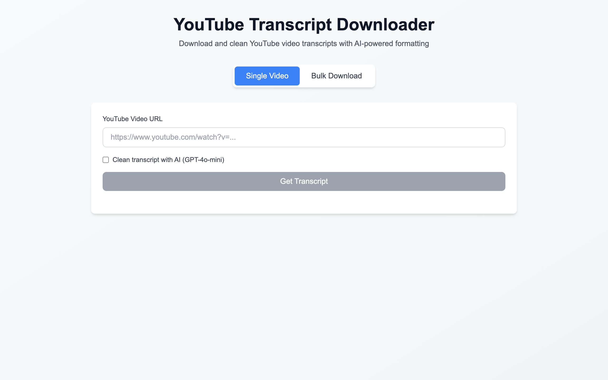
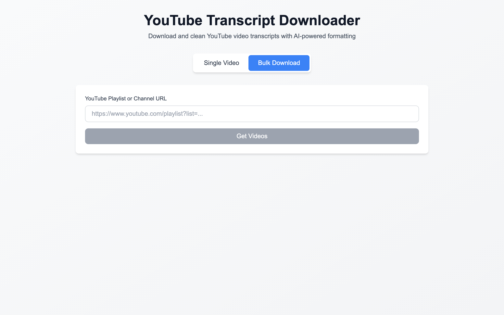
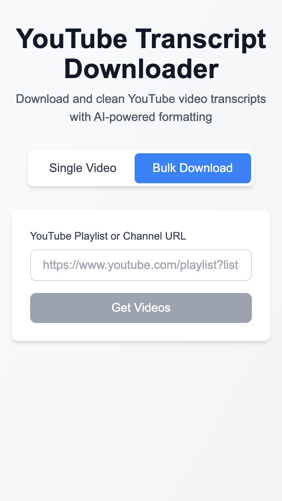

# Usage Guide

This guide explains how to use the YouTube Transcript Downloader to fetch and process video transcripts.

## Getting Started

After [installation](INSTALLATION.md), access the application at **http://localhost:3000**.

## Single Video Download

The Single Video tab allows you to download transcripts from individual YouTube videos.

### Step 1: Enter Video URL

1. Navigate to the **Single Video** tab
2. Paste a YouTube video URL in the input field

**Supported URL formats:**
- `https://www.youtube.com/watch?v=VIDEO_ID`
- `https://youtu.be/VIDEO_ID`
- `https://www.youtube.com/embed/VIDEO_ID`
- Just the video ID: `VIDEO_ID`

### Step 2: Configure Options

**Clean with AI** (Optional):
- Check this box to use GPT-4o-mini for transcript cleaning
- Removes filler words, fixes punctuation, and formats the text
- Requires OpenAI API key configured in `.env`

### Step 3: Fetch Transcript

Click **Get Transcript** to download the video's transcript.

**Loading States:**
- Spinner indicates fetching in progress
- Error messages appear if transcript is unavailable

### Step 4: Export Transcript

Once loaded, you have two export options:

1. **Copy to Clipboard** - Copies the full transcript text
2. **Download as .txt** - Saves as `{video_title}.txt`

## Bulk Playlist Download

The Bulk Download tab enables downloading multiple transcripts from playlists or channels.

### Step 1: Enter Playlist/Channel URL

1. Navigate to the **Bulk Download** tab
2. Paste a YouTube playlist or channel URL

**Supported URL formats:**
- Playlist: `https://www.youtube.com/playlist?list=PLAYLIST_ID`
- Channel videos: `https://www.youtube.com/@channel/videos`
- Channel playlists: `https://www.youtube.com/channel/CHANNEL_ID/playlists`

### Step 2: Load Video List

Click **Load Videos** to fetch the list of videos in the playlist/channel.

The interface displays:
- Video thumbnails
- Video titles
- Video durations
- Checkbox for selection

### Step 3: Select Videos

**Selection Options:**
- Click individual checkboxes to select specific videos
- Use **Select All** to select all videos
- Use **Select None** to deselect all

### Step 4: Configure Options

**Clean with AI** (Optional):
- Enable to clean all downloaded transcripts
- Note: This uses more API tokens for bulk operations

### Step 5: Download Transcripts

Click **Download Selected** to begin fetching transcripts.

**Progress Tracking:**
- Progress bar shows completion percentage
- Individual video status updates in real-time
- Failed downloads are marked with error indicators

### Step 6: Export Results

After completion:
- **Individual Download** - Click on any video to download its transcript
- **Download All** - Creates a ZIP file with all successful transcripts

## Mobile Usage

The application is fully responsive and works on mobile devices.

**Mobile Features:**
- Touch-friendly interface
- Responsive layout
- All features available

## Advanced Features

### Token Usage Tracking

When using AI cleaning, the interface displays:
- Tokens used per request
- Estimated cost
- Remaining quota

### Error Recovery

If a download fails:
1. Check if the video has transcripts enabled
2. Verify the video is public
3. Try again after a few seconds (rate limiting)

### Keyboard Shortcuts

| Shortcut | Action |
|----------|--------|
| `Enter` | Submit current form |
| `Ctrl/Cmd + C` | Copy transcript (when focused) |
| `Tab` | Navigate between elements |

## Tips & Best Practices

### Getting the Best Results

1. **Use AI Cleaning** for podcasts and interviews where speakers talk naturally
2. **Skip AI Cleaning** for scripted content that's already well-formatted
3. **Download in batches** of 10-20 videos to avoid rate limiting

### Handling Missing Transcripts

Some videos may not have transcripts:
- Live streams (unless captions were added later)
- Private or unlisted videos
- Videos where the creator disabled captions
- Very new videos (transcripts may take time to generate)

### Rate Limiting

The YouTube Transcript API has rate limits:
- Wait a few seconds between rapid requests
- For bulk downloads, the app automatically handles pacing
- If you see "Too Many Requests" errors, wait 60 seconds

## Next Steps

- [API Documentation](API.md) - Use the REST API directly
- [Architecture](ARCHITECTURE.md) - Understand how the system works
- [Testing](TESTING.md) - Run and write tests
